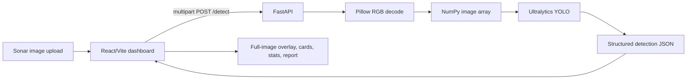
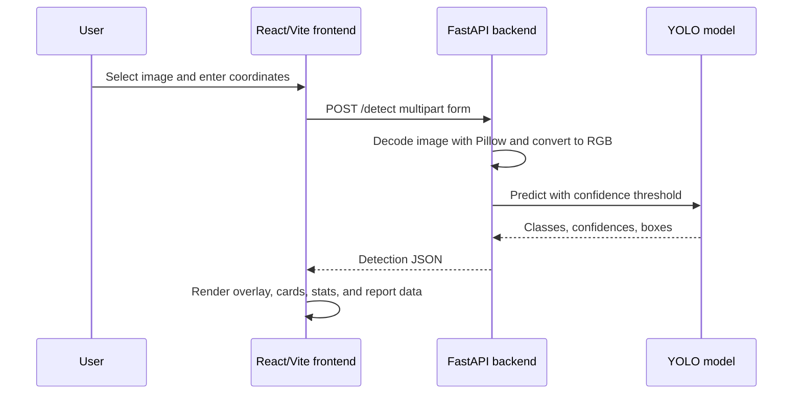

# DeepSight

DeepSight is a React and FastAPI prototype for detecting man-made underwater anomalies in side-scan sonar imagery. It accepts a sonar image and geographic coordinates, runs Ultralytics YOLO inference, and presents the detections with confidence values, original-image bounding boxes, location details, and an exportable JSON report.

> Project context: SIH26057, AI-powered automated underwater marine debris and anomaly detection for the Ministry of Earth Sciences (MoES) and the National Institute of Ocean Technology (NIOT).

## 1. Problem Statement

Side-scan sonar surveys can contain potential marine debris, infrastructure, and other anomalies that are difficult to review manually at scale. DeepSight provides a lightweight workflow for uploading an image, supplying the capture coordinates, and reviewing model detections.

The repository does not currently document training metrics, dataset size, accuracy, precision, recall, mAP, inference FPS, or training hardware.

## 2. Solution Overview

The current prototype combines:

- A Vite-powered React dashboard for image upload, coordinates, confidence-threshold selection, results, statistics, and reports.
- A FastAPI service that decodes uploaded images, runs a locally available or Hugging Face-hosted YOLO model, and returns structured detections.
- A full-image SVG overlay that displays all returned bounding boxes without changing the original upload preview.



## 3. Key Features

Implemented in the current working tree:

- Side-scan sonar image upload by file picker or drag and drop.
- Latitude and longitude input with Google Maps links.
- Configurable confidence threshold from 0% to 100%.
- Real YOLO inference through `POST /detect`.
- Dynamic detection count and dashboard statistics.
- Full original sonar image with responsive SVG bounding-box overlays.
- Class name, confidence, confidence level, location, and bounding-box dimensions for each detection.
- Empty state when no detections are returned.
- JSON report download containing the selected image, coordinates, threshold, and detections.
- Startup-time local model loading with a Hugging Face fallback for deployments.
- Configurable frontend API URL and backend CORS origins.
- Human-readable frontend error state and backend validation errors.

## 4. Supported Detection Classes

The locally available `backend/models/best.pt` was inspected with Ultralytics and reports these classes:

| Class | Description |
|---|---|
| Fishing Gear or Crab Pot | Model class for fishing gear or crab-pot detections. |
| Pipelines or Cylinders | Model class for pipeline or cylindrical-object detections. |
| ShipWrecks | Model class for shipwreck detections. |

These names come from `model.names`; the repository does not provide further class definitions or evaluation metrics.

## 5. System Architecture



## 6. End-to-End Processing Pipeline

1. The user selects or drops an image in the React dashboard.
2. The user supplies latitude and longitude and chooses a confidence threshold.
3. React sends `image`, `latitude`, `longitude`, and `confidence_threshold` as multipart form data.
4. FastAPI validates that the threshold is between `0` and `1`.
5. Pillow opens the uploaded file and converts it to RGB.
6. NumPy converts the RGB image to an array for inference.
7. Ultralytics YOLO runs prediction with the submitted confidence threshold.
8. The backend extracts class IDs, model class names, confidences, and original-image pixel coordinates.
9. FastAPI returns the structured JSON response.
10. React renders the full original image with an SVG overlay, one card per detection, statistics, and report data.

## 7. Backend

The backend is a FastAPI application in `backend/main.py` and is served with Uvicorn.

### Model loading

The model is resolved and loaded once when the application module starts:

1. `backend/models/best.pt` is used when it exists.
2. If it is absent, `HF_MODEL_REPO` and `HF_MODEL_FILENAME` are used with `huggingface_hub.hf_hub_download`.
3. Hugging Face's local cache is reused; the application does not download the model for each request.
4. `HF_TOKEN` is optional and is only needed when the configured repository requires authentication.

The repository does not contain a model download URL. The local model weights are intentionally ignored by Git, so developers must either place the weights at `backend/models/best.pt` or configure a Hugging Face repository themselves.

### Image and inference handling

The endpoint uses Pillow for decoding and RGB conversion, NumPy for the inference array, and Ultralytics YOLO for prediction. Bounding boxes are returned in original uploaded-image pixel coordinates. The configured threshold is passed directly to YOLO.

### CORS

`FRONTEND_ORIGIN` controls allowed origins. Multiple comma-separated origins are accepted. When it is unset, the backend allows `http://localhost:5173` and `http://127.0.0.1:5173` for local development.

## 8. Frontend

The frontend is a React application built with Vite. Tailwind CSS is provided through `@tailwindcss/vite` and the `tailwindcss` package.

`frontend/src/App.jsx` manages:

- Upload preview and file state.
- Coordinate and confidence-threshold inputs.
- API requests through `fetch` and `FormData`.
- Loading, completion, and error states.
- Dashboard statistics based on the latest successful response.
- Detection Results rendering through reusable overlay and card components.
- Google Maps links using the supplied latitude and longitude.
- JSON report generation in the browser.

The main upload image remains unannotated. Bounding boxes are drawn only in the Detection Results section over the full image. The frontend API base URL is read from `VITE_API_BASE_URL`.

## 9. AI Model

- Framework: Ultralytics YOLO.
- Task: object detection.
- Verified model type: Ultralytics `DetectionModel`.
- Verified input size setting: `640`.
- Verified stride: `[8, 16, 32]`.
- Expected local path: `backend/models/best.pt`.
- Model loading: once at backend startup.
- Inference threshold: submitted per request as `confidence_threshold` between `0` and `1`.

The locally inspected model reported the three classes listed above. Training metrics and dataset details are not currently documented in the repository.

## 10. Project Structure

Generated files, dependencies, virtual environments, and build output are omitted from this overview.

```text
DeepSight/
├── .gitignore
├── .python-version
├── README.md
├── cloudflared.exe                 # untracked local executable; no tunnel config is committed
├── backend/
│   ├── .env                        # local ignored configuration; values are not documented here
│   ├── .env.example
│   ├── main.py
│   ├── requirements.txt
│   └── models/
│       └── best.pt                 # local ignored model weight, present in this working tree
└── frontend/
    ├── .env.example
    ├── eslint.config.js
    ├── index.html
    ├── package.json
    ├── README.md                   # Vite-generated frontend note
    ├── vite.config.js
    ├── public/
    └── src/
        ├── App.css
        ├── App.jsx
        ├── index.css
        ├── main.jsx
        └── assets/
```

`best.pt` is excluded by `backend/models/*.pt` in `.gitignore`. It is present locally but is not a Git-distributed project file.

## 11. Installation

### Prerequisites

- Python 3.12 is the repository's recommended runtime in `.python-version`.
- Node.js and npm compatible with the installed Vite toolchain.
- A YOLO weight file at `backend/models/best.pt`, or a configured Hugging Face model repository.
- A supported environment for the PyTorch and Ultralytics dependencies.

The current local virtual environment was observed running Python 3.13.9 and successfully loaded the model. Python 3.12 is the documented deployment target for a more conservative runtime choice.

### Backend

From the repository root on Windows PowerShell:

```powershell
cd backend
python -m venv venv
.\venv\Scripts\Activate.ps1
python -m pip install -r requirements.txt
python -m uvicorn main:app --reload --host 127.0.0.1 --port 8000
```

On macOS/Linux, activate with `source venv/bin/activate` and use the same `pip install` and Uvicorn commands.

If the local model is used, place it at:

```text
backend/models/best.pt
```

If the model is not present, configure the Hugging Face variables described below before starting the backend.

### Frontend

In a second terminal:

```bash
cd frontend
npm install
npm run dev
```

The Vite development server uses its default port `5173` unless changed by the Vite CLI or environment. The example frontend configuration points to the backend at `http://127.0.0.1:8000`.

## 12. Environment Variables

| Variable | Purpose | Required |
|---|---|---|
| `VITE_API_BASE_URL` | Frontend base URL for the FastAPI service, without the `/detect` path. | Yes for a non-default API URL; local code defaults to `http://127.0.0.1:8000`. |
| `FRONTEND_ORIGIN` | Backend CORS allow-list. Multiple origins may be comma-separated. | No for local defaults; recommended in deployment. |
| `HF_MODEL_REPO` | Hugging Face repository ID used when the local model is absent. | Required only when no local model is available. |
| `HF_MODEL_FILENAME` | File name inside the Hugging Face repository. | No; defaults to `best.pt`. |
| `HF_TOKEN` | Optional Hugging Face authentication token for private or gated repositories. | No for public repositories. |

Create local `.env` files from the committed examples without copying secrets into Git. Vite variables are exposed to the browser, so do not put secrets in `frontend/.env`.

## 13. Running Locally

Backend:

```powershell
cd backend
.\venv\Scripts\Activate.ps1
python -m uvicorn main:app --reload --host 127.0.0.1 --port 8000
```

Frontend:

```bash
cd frontend
npm run dev
```

Open the Vite URL shown in the terminal, normally `http://localhost:5173`. The backend is normally available at `http://127.0.0.1:8000`.

## 14. API Reference

### `GET /`

Returns a basic service status message:

```json
{
  "message": "DeepSight API is running"
}
```

### `POST /detect`

Runs YOLO inference on one uploaded image.

Request content type: `multipart/form-data`.

| Field | Type | Required | Description |
|---|---|---:|---|
| `image` | file | Yes | Uploaded image readable by Pillow. |
| `latitude` | number | Yes | Sonar capture latitude. |
| `longitude` | number | Yes | Sonar capture longitude. |
| `confidence_threshold` | number | No | Value from `0` to `1`; defaults to `0.5`. |

Example request with safe example values:

```bash
curl -X POST http://127.0.0.1:8000/detect \
  -F "image=@example-sonar.png" \
  -F "latitude=17.1270" \
  -F "longitude=83.6324" \
  -F "confidence_threshold=0.50"
```

Important errors:

- `400`: uploaded file is not a valid image.
- `422`: malformed form data or a confidence threshold outside `0` to `1`.
- `500`: YOLO inference failure.
- Startup failure: the local model is missing and Hugging Face configuration is incomplete or download fails.

## 15. Detection Output

The response preserves original image dimensions and uses original-image pixel coordinates for each bounding box:

```json
{
  "success": true,
  "image": "example-sonar.png",
  "image_width": 591,
  "image_height": 576,
  "latitude": 17.127,
  "longitude": 83.6324,
  "confidence_threshold": 0.5,
  "detections": [
    {
      "class": "ShipWrecks",
      "class_id": 2,
      "confidence": 0.942,
      "bbox": {
        "x1": 150.0,
        "y1": 120.0,
        "x2": 360.0,
        "y2": 300.0,
        "width": 210.0,
        "height": 180.0
      },
      "latitude": 17.127,
      "longitude": 83.6324
    }
  ]
}
```

The values above are safe documentation examples, not a claimed evaluation result. A no-detection response contains the same top-level fields with `"detections": []`.

## 16. Deployment

### Production deployment

The backend supports production model resolution without committing the weight file:

- Set `HF_MODEL_REPO` to the Hugging Face repository containing the model.
- Set `HF_MODEL_FILENAME` when the repository file is not named `best.pt`.
- Set `HF_TOKEN` only for a private or gated repository.
- Set `FRONTEND_ORIGIN` to the deployed frontend origin.
- Set `VITE_API_BASE_URL` in the frontend build environment to the deployed backend base URL.
- Start the backend with Uvicorn using the provider's assigned host and port.

No Vercel, Render, Hugging Face Space, or other provider configuration is present in this repository, so a specific provider deployment cannot be verified from local files.

### Backup deployment

No backup deployment configuration is currently present in the repository. Provider names, URLs, and commands should be added only when they are actually configured.

### Local development

Use the local `best.pt` path and the default local CORS/API settings described in the installation sections.

### Temporary demo exposure

An untracked `cloudflared.exe` is present in the working tree, and terminal history shows an attempted Cloudflare Quick Tunnel command. No persistent Cloudflare configuration, named tunnel, domain, or stable URL is present. A Quick Tunnel, if used, should be treated as temporary demo exposure; its URL changes between sessions and is not permanent production infrastructure.

## 17. Novelty / Contribution

DeepSight integrates multi-class side-scan sonar detection, confidence-based filtering, geographic information, visual interpretation, and structured detection output into a single lightweight workflow. The repository does not establish claims of firstness, novelty over prior research, or benchmark superiority.

## 18. Limitations

- The current prototype accepts latitude and longitude as user input; it does not parse sonar ping headers or derive coordinates from image pixels.
- Training dataset composition and diversity are not documented in the repository.
- Cross-sonar-sensor and cross-environment generalization have not been established here.
- The three available classes may not cover all marine debris or underwater anomalies.
- The model weight is locally ignored by Git and requires a separate distribution or Hugging Face configuration for deployment.
- No accuracy, precision, recall, mAP, latency, or throughput claims can be verified from the repository.
- No persistent production hosting configuration is included.

## 19. Future Scope

Potential future work, not current functionality:

- Add additional debris and anomaly categories.
- Train and evaluate on larger, more diverse sonar datasets.
- Improve cross-sensor generalization.
- Add segmentation for more precise object boundaries.
- Parse sonar metadata or ping headers for direct georeferencing.
- Process large sonar logs or survey batches.
- Optimize the model for edge or autonomous underwater vehicle deployment.
- Apply model quantization or other inference optimizations.


## 20. Acknowledgements

The implementation uses the following verified software resources:

- React and React DOM for the frontend.
- Vite for frontend development and builds.
- Tailwind CSS and `@tailwindcss/vite` for styling.
- FastAPI and Uvicorn for the backend service.
- Ultralytics YOLO and its PyTorch runtime for object detection.
- Pillow and NumPy for image decoding and array preparation.
- `huggingface_hub` for optional startup-time model retrieval.
- Google Maps links for the existing coordinate-viewing action.
